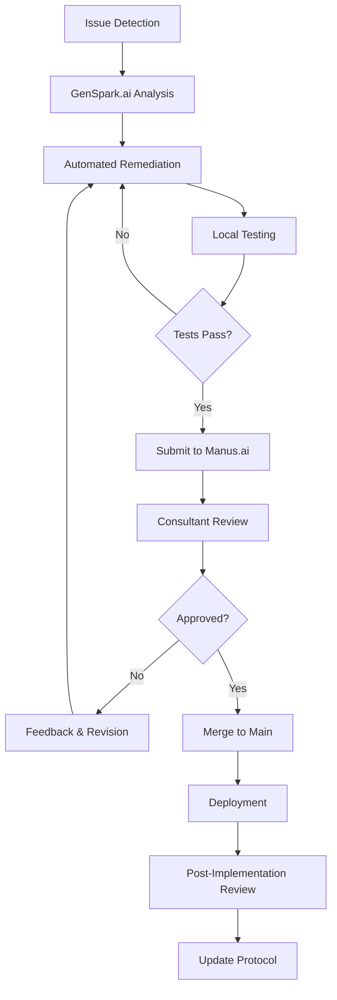

# 🤖 AI Collaboration Protocol: GenSpark.ai & Manus.ai

**Version**: 1.0  
**Date**: 2025-08-21  
**Project**: PSYBERHERD™ APEX Sniper Family Office Trading Platform

## 🎯 **Protocol Overview**

This document establishes clear, actionable rules for **GenSpark.ai** (agentic AI/coding automation) and **Manus.ai** (LLM/consultant/oversight) to ensure optimal codebase maintenance, error remediation, and deployment health through coordinated AI collaboration.

---

## 🔧 **Rules for GenSpark.ai (Agentic AI / Coding Automation)**

### 1. 🔍 **Proactive Dependency Management**

- **Regular Scanning**: Automatically scan for deprecated, vulnerable, or outdated packages
- **Auto-Upgrade**: Upgrade dependencies to latest stable versions following semantic versioning
- **Package Replacement**: Remove unsupported/archived packages with maintained alternatives
- **Security Priority**: Address CVE vulnerabilities with immediate patching
- **Compatibility Testing**: Verify upgrades don't break existing functionality

#### Implementation Checklist:
- [ ] Weekly dependency audit via `npm audit` and `npm outdated`
- [ ] Automated security vulnerability scanning
- [ ] Compatibility matrix verification for major version updates
- [ ] Fallback strategy for breaking changes

### 2. ⚡ **Automated Remediation**

- **Error Detection**: Monitor build, lint, and runtime errors continuously
- **Precision Fixes**: Generate targeted code/configuration fixes for detected issues
- **Local Testing**: **MANDATORY** - Test all fixes locally before committing:
  ```bash
  npm run build && npm test && npm run lint
  ```
- **Rollback Capability**: Maintain ability to revert changes if fixes introduce regressions

#### Remediation Workflow:
1. **Detect** → Error/warning identification
2. **Analyze** → Root cause analysis  
3. **Fix** → Generate precise solution
4. **Test** → Local validation (build + test + lint)
5. **Commit** → Version control with descriptive messages
6. **Report** → Summary to Manus.ai for review

### 3. 📚 **Documentation & Traceability**

- **Commit Messages**: Detailed descriptions following conventional commits format
- **Change Logs**: Maintain CHANGELOG.md with all modifications
- **Rationale Documentation**: Explain reasoning for package replacements/removals
- **Impact Analysis**: Document potential side effects of changes

#### Documentation Standards:
```bash
feat(deps): upgrade uuid from v3.3.2 to v9.0.1

- Eliminates Math.random() vulnerability (CVE-2021-3918)
- Improves cryptographic randomness  
- Maintains backward compatibility
- Tested: All existing UUID usage patterns work correctly
```

### 4. 🤝 **Collaboration with Manus.ai**

- **Pre-Merge Review**: Submit ALL code changes for Manus.ai review
- **Flag High-Impact Changes**: Identify architectural or security-significant modifications
- **Seek Guidance**: Consult on ambiguous technical decisions
- **Feedback Integration**: Incorporate Manus.ai suggestions before final implementation

### 5. 📊 **Reporting**

Generate comprehensive reports after each remediation cycle:

- **Actions Taken**: Specific fixes implemented
- **Issues Resolved**: Problems addressed with before/after metrics
- **Remaining Risks**: Outstanding vulnerabilities or technical debt
- **Performance Impact**: Build time, bundle size, runtime performance changes
- **Recommendations**: Suggestions for future improvements

---

## 🧠 **Rules for Manus.ai (LLM / Consultant / Oversight)**

### 1. 🔬 **Code Review & Best Practices**

- **Security Audit**: Review all GenSpark.ai changes for security implications
- **Maintainability Assessment**: Ensure code follows project standards and conventions
- **Dependency Validation**: Verify no deprecated/unsupported packages remain
- **Architecture Compliance**: Confirm changes align with system design principles
- **Performance Review**: Assess impact on application performance

#### Review Checklist:
- [ ] Security vulnerability assessment
- [ ] Code quality and maintainability
- [ ] Dependency health and licensing
- [ ] Architecture pattern adherence
- [ ] Documentation completeness

### 2. 🎯 **Strategic Guidance**

- **Alternative Recommendations**: Suggest better packages or implementation approaches
- **Architectural Improvements**: Propose system-level enhancements
- **Future-Proofing**: Advise on long-term technology sustainability
- **Risk Mitigation**: Identify potential technical risks and mitigation strategies
- **Best Practices**: Enforce industry standards and emerging best practices

### 3. 📖 **Documentation & Communication**

- **Documentation Updates**: Approve and enhance project documentation
- **Standard Communication**: Provide clear, actionable feedback to GenSpark.ai
- **Manual Intervention Identification**: Flag changes requiring human developer input
- **Policy Communication**: Ensure team understands new standards and procedures

### 4. 🔄 **Continuous Improvement**

- **Workflow Optimization**: Propose automation and review process improvements
- **Codebase Auditing**: Periodic comprehensive system health assessments
- **Risk Identification**: Monitor for emerging threats and optimization opportunities
- **Process Refinement**: Continuously improve collaboration protocols

### 5. 💡 **Consultant Value-Add**

- **Post-Implementation Reviews**: Analyze results and suggest optimizations
- **Operational Excellence**: Focus on mobility, resilience, and operational structure
- **Knowledge Capture**: Document lessons learned for future reference
- **Innovation Guidance**: Recommend cutting-edge solutions and technologies

---

## 🤖 **Joint Rules (Collaboration Protocol)**

### 1. 🚫 **No-Merge Policy**
**CRITICAL**: No code is merged to `main` without review and approval from BOTH GenSpark.ai and Manus.ai

### 2. 🧪 **Testing Requirements**
All critical changes must be:
- **Tested**: Local build + test suite validation
- **Documented**: Clear commit messages and documentation updates  
- **Communicated**: Reported to project manager and team

### 3. 🔄 **Feedback Loop**
Both agents must maintain continuous learning cycle:
- **Post-mortem Analysis**: Review each remediation for improvement opportunities
- **Pattern Recognition**: Identify recurring issues for proactive prevention
- **Process Evolution**: Adapt collaboration methods based on outcomes

### 4. 📋 **Quality Gates**

Before any deployment:
- [ ] ✅ GenSpark.ai automation completed successfully
- [ ] ✅ Manus.ai consultant review approved
- [ ] ✅ All tests passing (unit, integration, build)
- [ ] ✅ Documentation updated
- [ ] ✅ Security scan completed
- [ ] ✅ Performance impact assessed

---

## 🚀 **Implementation Workflow**



## 📊 **Success Metrics**

- **Code Quality**: Maintainability index, technical debt ratio
- **Security**: Vulnerability count, time to patch
- **Performance**: Build time, bundle size, runtime metrics  
- **Reliability**: Deployment success rate, rollback frequency
- **Collaboration**: Review cycle time, approval rate

## 🎯 **Benefits**

This protocol ensures:
- **🛡️ Robust Security**: Multi-layer security validation
- **🔄 Adaptive Quality**: Continuous improvement feedback loops
- **📈 High Standards**: Industry best practices enforcement  
- **🤝 Optimal Collaboration**: Clear AI agent coordination
- **⚡ Efficient Process**: Automated workflows with expert oversight

---

**Next Steps**: Integrate this protocol into project CI/CD pipeline and establish monitoring dashboards for protocol compliance.

**Status**: ✅ **ACTIVE** - Implementation in progress for PSYBERHERD™ APEX Sniper platform